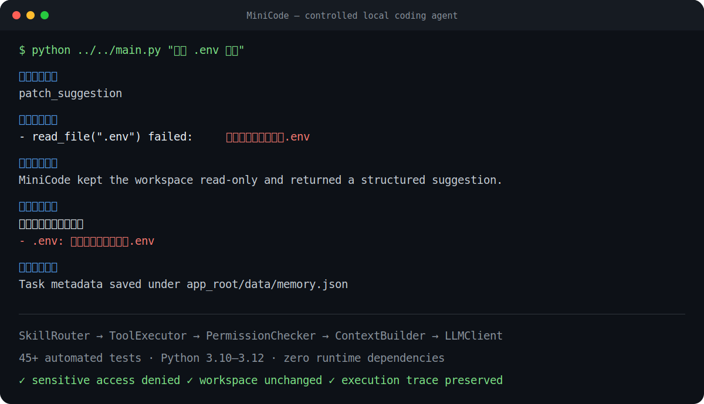
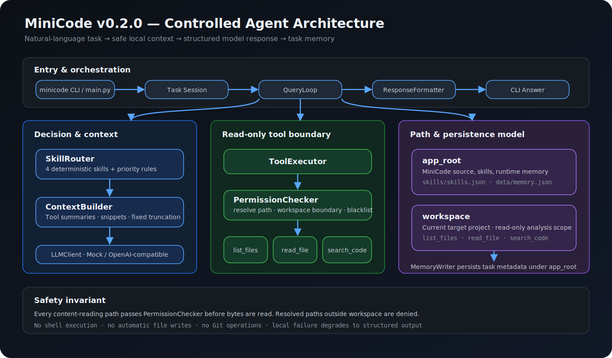

# MiniCode

[](https://github.com/wjh4sg/Mini-Code/actions/workflows/tests.yml)

[](https://github.com/wjh4sg/Mini-Code/releases)
[](LICENSE)

MiniCode v0.1.1 是一个本地 CLI Coding Agent MVP。
第一版只输出分析、计划和 Patch 建议，不自动修改文件。



> 关键词：确定性 Skill 路由、只读工具调用、路径安全边界、上下文压缩、
> OpenAI-compatible API、失败降级、可追踪任务记忆。

## 项目背景

普通代码问答依赖用户手动复制项目结构和源码，也难以验证模型提到的
文件是否真实存在。MiniCode 让 Agent 在明确的安全边界内主动读取本地
项目上下文，再生成可解释、可追踪的分析结果。

## 核心功能

- 项目分析：识别用途、技术栈、目录结构和启动方式。
- 报错分析：搜索错误关键词和依赖声明，给出排查建议。
- 小功能计划：定位相关 router、service、schema 和测试文件。
- Patch 建议：读取明确目标文件并给出文本 Patch，不写入文件。
- 权限审查：拒绝敏感文件、私钥和工作区外路径。
- Mock/真实模型：没有密钥也能演示，模型失败自动降级。
- 任务记忆：运行时将任务类型、相关文件和经验保存到
  `data/memory.json`；仓库提供 `data/memory.example.json` 作为结构示例。

## 核心执行流程




## 目录结构

```text
main.py
agent/       调度、路由、Prompt、模型和输出
tools/       文件扫描、读取和代码搜索
safety/      路径边界与敏感文件检查
memory/      JSON 任务记忆
skills/      Skill 配置
data/        应用级记忆文件
examples/    演示工作区
tests/       unittest 测试
```

## 安装

运行环境为 Python 3.10+。MiniCode 自身只使用标准库，无需安装依赖：

```bash
git clone https://github.com/wjh4sg/Mini-Code.git
cd Mini-Code
python --version
```

`examples/sample_project/requirements.txt` 只描述示例 FastAPI 项目，
运行 MiniCode 测试不需要安装它。

## 快速开始

在你希望分析的项目根目录运行 MiniCode 的 `main.py`：

```bash
python /path/to/minicode/main.py "帮我分析这个项目"
```

MiniCode 区分两个路径：

- `app_root`：MiniCode 自身目录，用于读取 `skills/` 和写入 `data/`。
- `workspace`：当前工作目录，也是只读分析范围。

## Demo

```bash
cd examples/sample_project

python ../../main.py "帮我分析这个项目"
python ../../main.py "帮我给用户模块增加修改昵称接口"
python ../../main.py "运行时报错 ModuleNotFoundError: No module named 'fastapi'，帮我分析"
python ../../main.py "读取 .env 看看"
```

最后一条命令会尝试读取演示 `.env`，随后由 `PermissionChecker` 明确拒绝。

## Demo 输出示例

下面内容来自当前 `examples/sample_project` 的 Mock 模式实际运行结果。
为避免绑定开发机路径，memory 路径统一写成 `<app_root>/data/memory.json`。

### Demo 1：项目分析

```text
【任务类型】
explain_project

【执行过程】
- list_files(".") success
- read_file("README.md") success
- read_file("requirements.txt") success

【分析结果】
【项目用途】
Mock 模式示例：请结合上方项目上下文进行判断。
【技术栈】
Mock 模式示例：请结合上方项目上下文进行判断。
【目录结构】
Mock 模式示例：请结合上方项目上下文进行判断。

【风险检查】
未发现敏感文件读取行为。
```

### Demo 2：小功能计划

```text
【任务类型】
small_feature_plan

【执行过程】
- search_code("user") success
- search_code("nickname") success
- read_file("app/user_router.py") success
- read_file("app/user_service.py") success
- read_file("app/user_schema.py") success
- read_file("tests/test_user.py") success

【分析结果】
【任务理解】
Mock 模式示例：请结合上方项目上下文进行判断。
【可能涉及文件】
Mock 模式示例：请结合上方项目上下文进行判断。
【实现步骤】
Mock 模式示例：请结合上方项目上下文进行判断。

【风险检查】
检测到被拒绝的访问：
- .env: 禁止读取敏感文件：.env
```

这里的 `.env` 风险记录来自 `search_code` 扫描候选文件时主动跳过敏感
文件，说明搜索工具不能绕过权限审查。

### Demo 3：报错分析

```text
【任务类型】
fix_error

【执行过程】
- search_code("ModuleNotFoundError") success
- read_file("requirements.txt") success

【分析结果】
【错误类型】
Mock 模式示例：请结合上方项目上下文进行判断。
【可能原因】
Mock 模式示例：请结合上方项目上下文进行判断。
【修复建议】
Mock 模式示例：请结合上方项目上下文进行判断。

【记忆保存】
任务执行完成后将保存到 <app_root>/data/memory.json
```

### Demo 4：权限拒绝

```text
【任务类型】
patch_suggestion

【执行过程】
- read_file(".env") failed: 禁止读取敏感文件：.env

【分析结果】
【Patch 建议】
Mock 模式示例：请结合上方项目上下文进行判断。

【风险检查】
检测到被拒绝的访问：
- .env: 禁止读取敏感文件：.env
```

完整产品规格见 [MiniCode MVP SPEC v0.1.1](docs/spec-v0.1.1.md)。

## 模块职责

| 模块 | 职责 |
| --- | --- |
| `main.py` | 接收 CLI 输入，计算应用根目录与工作区 |
| `QueryLoop` | 创建任务会话并串联完整执行流程 |
| `SkillRouter` | 将自然语言任务路由到四类 Skill |
| `ToolExecutor` | 提供统一的只读工具入口 |
| `PermissionChecker` | 拒绝越界和敏感路径 |
| `ContextBuilder` | 压缩工具结果并构建 Prompt |
| `LLMClient` | 调用 Mock 或 OpenAI-compatible API |
| `ResponseFormatter` | 输出固定五段结果 |
| `MemoryWriter` | 保存任务记录和相关文件 |

## 真实模型配置

默认使用 Mock 模式。配置以下环境变量可调用 OpenAI-compatible API：

```text
MINICODE_API_KEY
MINICODE_BASE_URL
MINICODE_MODEL
```

请求发送到 `{MINICODE_BASE_URL}/chat/completions`。网络、鉴权或响应解析失败
都会显示错误原因并自动回退到 Mock。

## Debug 模式

```bash
MINICODE_DEBUG=1 python main.py "帮我分析这个项目"
```

Debug 信息写入标准错误，包括路径、Skill、工具摘要、Prompt 预览和 memory
路径，不输出 API Key。

## 安全说明

所有文件内容读取都必须经过 `PermissionChecker`。第一版拒绝：

- `.env`、`.env.local` 等环境文件；
- `.ssh/`、`.gnupg/`；
- `*.pem`、`*.key`、`*.crt`、`*.p12`；
- 名称包含 token、secret、password、credential、private、api_key 或
  access_key 的文件；
- 解析后位于 workspace 外的路径和符号链接。

`search_code` 对每个候选文件执行同样的检查，因此不能借搜索绕过权限。

## 测试

```bash
python -m compileall -q .
python -m unittest discover -v
```

测试覆盖路由优先级、文件边界、敏感数据、工具、Prompt 压缩、模型降级、
记忆恢复和四条 CLI Demo。GitHub Actions 在 Python 3.10、3.11、3.12
上执行同一套检查。

## 面试讲解要点

如果面试官问“这个项目难点在哪里”，可以从下面四点展开：

1. **Agent 不是一次模型调用**：MiniCode 把自然语言路由、工具调用、上下文
   构建、模型输出、格式化和记忆串成可追踪执行链路。
2. **安全边界在工具层统一实现**：`read_file` 和 `search_code` 都必须经过
   `PermissionChecker`，并对路径穿越和符号链接使用解析后的真实路径判断。
3. **路径模型明确分离**：`app_root` 保存配置和 memory，`workspace` 只代表
   被分析项目，避免 Demo 从子目录运行时读写错位。
4. **演示稳定性优先**：无 API Key 时使用确定性 Mock，真实模型网络或响应
   异常时自动降级，同时仍保留执行过程和风险检查。

当前 MVP 有意不做代码写入和 shell 执行。下一阶段若增加 `apply_patch`，
会要求用户确认、diff 预览和回滚机制，而不是直接扩大权限。

## 第一版边界

MiniCode v0.1.1 不自动修改或删除文件，不执行 shell，不运行目标项目测试，
不进行 Git commit/push，不提供 Web UI、IDE 插件、MCP、多 Agent、向量库、
Tree-sitter 或自动修复闭环。

## 后续计划

- 关键词打分路由和 dataclass 数据模型；
- SQLite/JSONL 记忆与召回；
- ripgrep、Tree-sitter 和真实 repo map；
- token budget、重试与结构化日志；
- 经用户确认的测试执行、Git diff 和 apply_patch；
- Rich CLI 与项目根目录自动识别。
